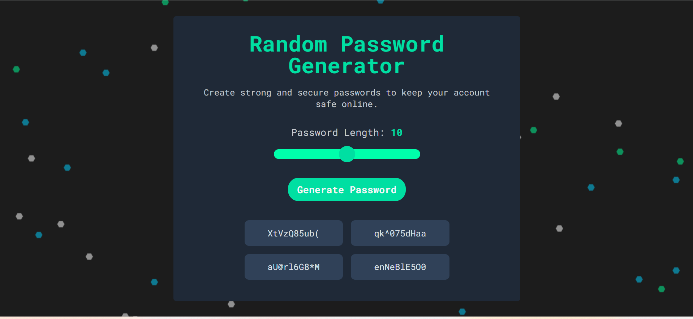

# Random Password Generator

A web app to generate random passwords. Users can instantly generate 4 different passwords with customizable lengths and easily copy them to the clipboard with a single click.

---

---

## Features

- Generate **4 random passwords** simultaneously
- Adjustable password length **8–12 characters**
- Set password length using a **range slider**
- **Real-time** display of selected password length
- Click a password to **copy it to the clipboard**
- Stylish background animation using **particles.js**
- Fully **responsive and mobile-friendly** design

---

## 🛠️ Technologies Used

- **HTML5**
- **CSS3**
- **JavaScript (ES6)**
- **[particles.js](https://vincentgarreau.com/particles.js/)** – For animated background effects
- **Google Fonts** – Roboto Mono

---

## What I Learned

- DOM manipulation and event handling in JavaScript
- Working with sliders and dynamically updating UI elements
- Clipboard API for copying text programmatically
- Custom toast notification implementation
- Responsive design using media queries
- Styling range inputs and responsive grids
- Integrating third-party JavaScript libraries (like `particles.js`)
- Implementing particle backgrounds using particles.js

---

## 🔗 Useful Resources

- [particles.js](https://vincentgarreau.com/particles.js/) – Particle background library
- [GeeksForGeeks - Random String Generator](https://www.geeksforgeeks.org/javascript/random-string-generator-using-javascript/)
- [Color hunt](https://colorhunt.co/) – For color picking
- [MDN Web Docs - Math.random()](https://developer.mozilla.org/en-US/docs/Web/JavaScript/Reference/Global_Objects/Math/random)
- [MDN Web Docs - Clipboard API](https://developer.mozilla.org/en-US/docs/Web/API/Clipboard_API)
- [W3Schools - Range Slider Styling](https://www.w3schools.com/howto/howto_js_rangeslider.asp)

---

## ⚠️ Disclaimer

This password generator uses **`Math.random()`**, which produces pseudo-random numbers, which is **not cryptographically secure**. While it produces passwords that appear random and are suitable for **learning purposes, prototypes, or low-risk use cases**, it should **not** be used for generating passwords for sensitive or critical systems.

For truly secure password generation, consider using APIs or libraries like:

- [`crypto.getRandomValues()` (MDN)](https://developer.mozilla.org/en-US/docs/Web/API/Crypto/getRandomValues)
- [bcrypt](https://www.npmjs.com/package/bcrypt)
- [OWASP Password Generator Guidelines](https://cheatsheetseries.owasp.org/cheatsheets/Password_Storage_Cheat_Sheet.html)

---

## 👩‍💻 Author

**Yusra**   
[Connect with me on LinkedIn](https://www.linkedin.com/)

---

> “A strong password is your first line of defense — make it count.” 🔐
