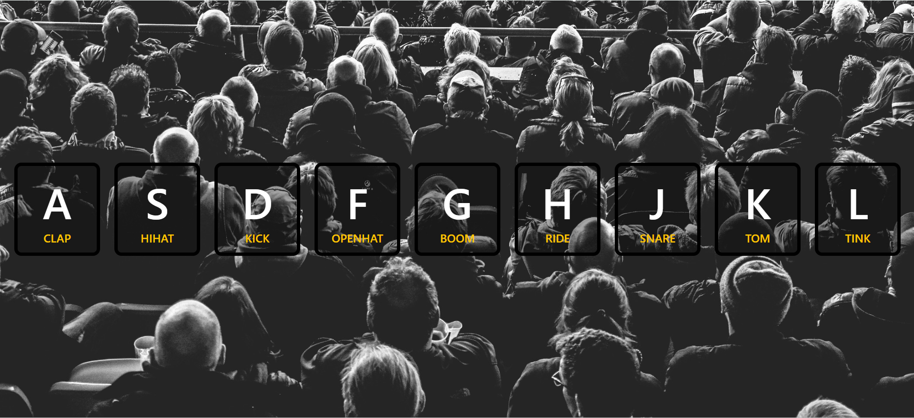

# Drum Kit

This is the first project from the **JavaScript30 Challenge by Wes Bos**.  
It’s a fun little drum kit app built with **HTML, CSS, and JavaScript**, where you can press keys on your keyboard to play drum sounds with a cool animation.

---

## Features
- Press **A–L keys** on your keyboard to play different drum sounds.
- Visual highlight effect when a key is pressed.
- Smooth animations using CSS transitions.

---

## Preview

---

## Keys & Sounds

| Key | Sound    |
|-----|----------|
| A   | Clap     |
| S   | Hi-Hat   |
| D   | Kick     |
| F   | Open-Hat |
| G   | Boom     |
| H   | Ride     |
| J   | Snare    |
| K   | Tom      |
| L   | Tink     |

---

## Technologies Used
- **HTML5** – Structure of the app  
- **CSS3** – Styling and animations  
- **JavaScript (ES6)** – Event handling and audio playback  

---

## What I Learned
- How to use **data-** attributes to connect HTML elements with JavaScript.
- Handling keyboard events (**keydown**) to trigger actions.
- Using CSS transitions and listening for **transitionend** events in JavaScript.
- Resetting audio playback with **audio.currentTime = 0** so sounds can overlap.

---

## 🔗 Useful Resources
- [MDN Web Docs: Keyboard Events](https://developer.mozilla.org/en-US/docs/Web/API/KeyboardEvent) Great reference for understanding keyboard event properties  
- [MDN Web Docs: data-* Attributes](https://developer.mozilla.org/en-US/docs/Learn/HTML/Howto/Use_data_attributes) Explains how to use custom data- attributes effectively.

---

## Author
- **GitHub:** [@Yus-raa](https://github.com/Yus-raa)
- **LinkedIn:** [Yusra Yaseen](https://www.linkedin.com/in/yusrayaseen)